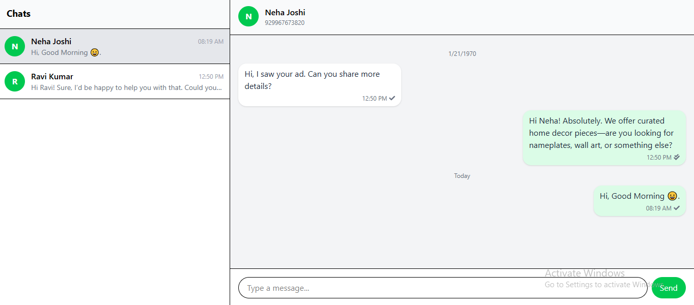
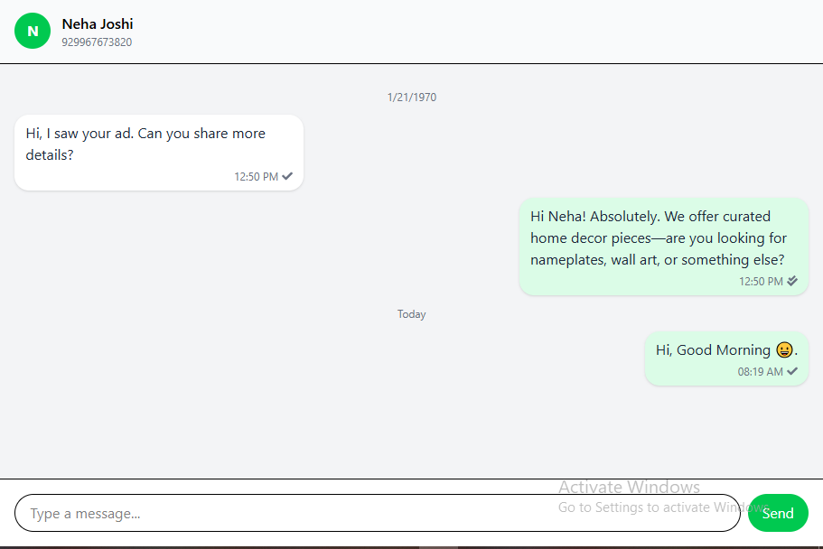

# WhatsApp Chat App

A full-stack real-time chat application built with **React**, **Node.js**, **Express**, **MongoDB**, and **Socket.IO**.

## 🚀 Live Demo
- **Frontend (Vercel)**: [https://whatsapp-chat-app-six.vercel.app](https://whatsapp-chat-app-six.vercel.app)
- **Backend (Render)**: [https://whatsapp-chat-app-g0lu.onrender.com/](https://whatsapp-chat-app-g0lu.onrender.com)
- **GitHub Repository**: [https://github.com/sharmaHarshit2000/whatsapp-chat-app](https://github.com/sharmaHarshit2000/whatsapp-chat-app)

---

## 📂 File Structure

```
whatsapp-chat-app/
│
├── backend/
│   ├── models/
│   │   └── Message.js
│   ├── routes/
│   │   ├── conversations.js
│   │   └── webhook.js
│   ├── scripts/
│   │   └── process_payloads.js
│   ├── server.js
│   ├── package.json
│   └── .env
│
├── frontend/
│   ├── src/
│   │   ├── components/
│   │   │   ├── ChatWindow.jsx
│   │   │   ├── Sidebar.jsx
│   │   │   └── MessageBubble.jsx
│   │   ├── App.jsx
│   │   ├── api.js
│   │   └── index.jsx
│   ├── public/
│   ├── package.json
│   └── vite.config.js
│
└── README.md
```

---

## 🛠️ Tech Stack

### Frontend:
- React
- Vite
- Tailwind CSS
- Socket.IO Client
- Axios

### Backend:
- Node.js
- Express
- MongoDB (Mongoose)
- Socket.IO
- dotenv
- cors

---

## ⚙️ Setup Instructions

### 1️⃣ Clone the Repository
```bash
git clone https://github.com/sharmaHarshit2000/whatsapp-chat-app.git
cd whatsapp-chat-app
```

### 2️⃣ Backend Setup
```bash
cd backend
npm install
```

Create a `.env` file:
```env
PORT=4000
MONGODB_URI=your_mongodb_connection_string
WEBHOOK_URL=http://localhost:4000/webhook
BUSINESS_NUMBER=918329446654
```

Start the backend:
```bash
npm start
```

### 3️⃣ Frontend Setup
```bash
cd frontend
npm install
```

Create a `.env` file:
```env
VITE_REACT_APP_API_URL=http://localhost:4000
```

Start the frontend:
```bash
npm run dev
```

---

## 📸 Screenshots

### Chat List & Conversation


### Sending & Receiving Messages


---

